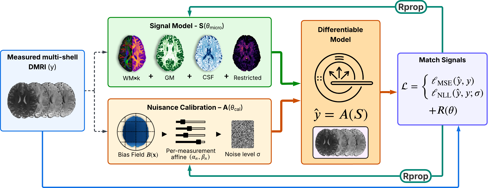

# PRISM

Code for the MICCAI 2026 paper "PRISM: Differentiable Analysis-by-Synthesis for
Fixel Recovery in Diffusion MRI" (Abouagour et al.).

PRISM fits a multi-compartment dMRI forward model (CSF, GM, K white-matter
fibers, restricted compartment) end-to-end with PyTorch + Rprop, jointly
estimating microstructure and nuisance calibration (bias field, per-measurement
affine, noise sigma). MSE and Rician-NLL objectives are supported.

## Install

    python -m venv .venv && source .venv/bin/activate
    pip install -r requirements.txt

Python 3.12, PyTorch >= 2.0, DIPY >= 1.12. A CUDA GPU is recommended.

## Run

Fit:

    python scripts/simple_fit_microstructure.py \
        --dwi dwi.nii.gz --bvals bvals --bvecs bvecs --mask mask.nii.gz \
        --all-slices --slab-mode --n-fibers 5 --n-steps 300 --use-rician \
        --device cuda --outdir out/

Benchmarks (DiSCo data fetched via DIPY):

    # Synthetic crossing-fiber benchmark (Table 1: PRISM, CSD, MSMT-CSD, ODF-FP, ...)
    python benchmarks/multitensor_narrow_all_methods.py --snr-levels 30 --seed 203 --device cuda

    # DiSCo1 tractography + ablation
    python benchmarks/ablation_disco1.py --fit --eval

    # HCP whole-brain fit + Dice vs FreeSurfer (--no-eddy: per-measurement affine off)
    python scripts/simple_fit_microstructure.py \
        --dwi DWI --bvals bvals --bvecs bvecs --mask mask.nii.gz \
        --all-slices --slab-mode --slab-size 16 --overlap 10 \
        --n-fibers 3 --n-steps 70 --no-eddy --device cuda --outdir out/hcp
    python invivo/hcp_dice_vs_freesurfer.py --prism-dir out/hcp --hcp-dir HCP_DIR

Visualize fiber peaks as ODF glyphs from any fit directory:

    python scripts/visualize_odf.py --fit-dir out/ --n-fibers 5 --out odf.png

## Reproducing the paper's numbers

Precomputed results are under `results/`; the commands above regenerate them.
Verified on the released code (NVIDIA L40S/H100, torch 2.9.1).

Synthetic crossing-fiber (Table 1) reproduces exactly:

    results/synthetic_table1/narrow_crossing_results.json
    # PRISM_MSE 3.5 deg / PRISM_NLL 2.3 deg best-match angular error; 95 / 99 % recall;
    # 1.9x lower error than the best baseline MSMT-CSD (6.8 deg).

DiSCo1 connectivity + incremental ablation reproduces:

    results/disco1/disco1_connectivity_r.json   # PRISM r=.934 @25deg vs MSMT-CSD .920
    results/disco1/ablation_incremental.json     # vanilla .84 -> +restricted .93 -> full .93

HCP 100307 tissue Dice reproduces from raw data. Provide your own HCP 100307 download
plus a FreeSurfer tissue segmentation at `<HCP_DIR>/t1_segmentation/t1_tissue_gt.nii.gz`
(labels 0=WM, 1=GM, 2=CSF). The whole-brain fit uses MSE mode with `--no-eddy`:

    python scripts/simple_fit_microstructure.py \
        --dwi DWI --bvals bvals --bvecs bvecs --mask mask.nii.gz \
        --all-slices --slab-mode --slab-size 16 --overlap 10 \
        --n-fibers 3 --n-steps 70 --no-eddy --device cuda --outdir out/hcp
    python invivo/hcp_dice_vs_freesurfer.py --prism-dir out/hcp --hcp-dir HCP_DIR
    # -> Argmax Dice WM ~0.79 / GM ~0.80, Pearson r ~0.75 / 0.67, MSE ~6.3e-3

`--no-eddy` (per-measurement affine intensity correction off) is required to match the
paper's HCP numbers; tissue metrics are seed-stable to <0.003 and consistent across GPUs.

## License

MIT (see LICENSE).
